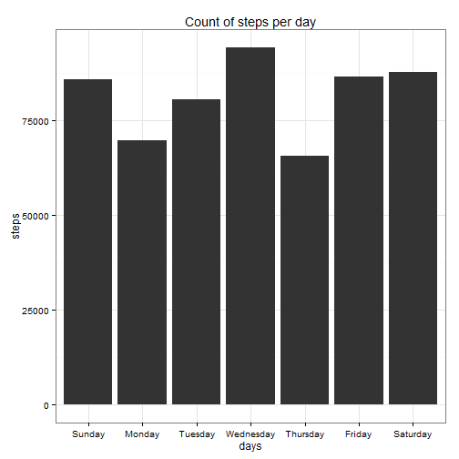
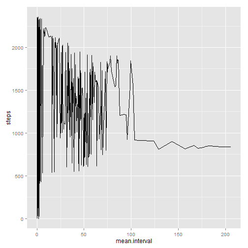
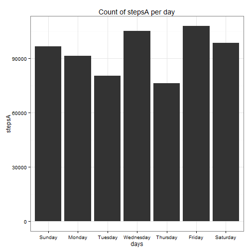
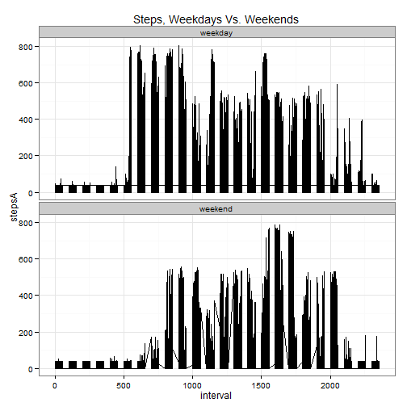

# Reproducible Research: Peer Assessment 1

It is now possible to collect a large amount of data about personal movement using activity monitoring devices such as a Fitbit, Nike Fuelband, or Jawbone Up. These type of devices are part of the “quantified self” movement – a group of enthusiasts who take measurements about themselves regularly to improve their health, to find patterns in their behavior, or because they are tech geeks. But these data remain under-utilized both because the raw data are hard to obtain and there is a lack of statistical methods and software for processing and interpreting the data.

This assignment makes use of data from a personal activity monitoring device. This device collects data at 5 minute intervals through out the day. The data consists of two months of data from an anonymous individual collected during the months of October and November, 2012 and include the number of steps taken in 5 minute intervals each day.

### Data

The data for this assignment can be downloaded from the course web site:

Dataset: Activity monitoring data [52K]
The variables included in this dataset are:

steps: Number of steps taking in a 5-minute interval (missing values are coded as NA)

date: The date on which the measurement was taken in YYYY-MM-DD format

interval: Identifier for the 5-minute interval in which measurement was taken

The dataset is stored in a comma-separated-value (CSV) file and there are a total of 17,568 observations in this dataset.

### Assignment

This assignment will be described in multiple parts. You will need to write a report that answers the questions detailed below. Ultimately, you will need to complete the entire assignment in a single R markdown document that can be processed by knitr and be transformed into an HTML file.

Throughout your report make sure you always include the code that you used to generate the output you present. When writing code chunks in the R markdown document, always use echo = TRUE so that someone else will be able to read the code. This assignment will be evaluated via peer assessment so it is essential that your peer evaluators be able to review the code for your analysis.

For the plotting aspects of this assignment, feel free to use any plotting system in R (i.e., base, lattice, ggplot2)

Fork/clone the GitHub repository created for this assignment. You will submit this assignment by pushing your completed files into your forked repository on GitHub. The assignment submission will consist of the URL to your GitHub repository and the SHA-1 commit ID for your repository state.

NOTE: The GitHub repository also contains the dataset for the assignment so you do not have to download the data separately.

## Loading and preprocessing the data

Show any code that is needed to

Load the data (i.e. read.csv())

Process/transform the data (if necessary) into a format suitable for your analysis


```r
#----------1.1--------------
#load libraries and data file
library(Hmisc)
library(ggplot2)
library(knitr)
act <- read.csv("activity.csv")

#----------1.2--------------
# process and transform data
cc <- complete.cases(act)
act <- act[cc, ]
act$date <- as.Date(act$date, format = "%Y-%m-%d")
act$days <- weekdays(act$date)
total.steps.1 <- sum(act$steps)
```
## What is mean total number of steps taken per day?

For this part of the assignment, you can ignore the missing values in the dataset.

Make a histogram of the total number of steps taken each day

Calculate and report the mean and median total number of steps taken per day


```r
#----------2.1--------------
##make a histogram of daily steps
q0 <- aggregate(x = act$steps, by = list(act$days), sum)
names(q0) <- c('days','steps')
q0$days <- factor(q0$days, levels=c("Sunday","Monday", "Tuesday", "Wednesday", "Thursday", "Friday", "Saturday"), ordered=T)
ggplot(q0, aes(x=days, y=steps)) + geom_bar(stat="identity") + ggtitle('Count of steps per day') + theme_bw()
```

 

```r
#----------2.2--------------
# mean of activity by days
q1 <- aggregate(x = act$steps, by = list(act$days), FUN = mean, na.rm = TRUE)
names(q1) <- c('date','mean.steps')
cat('mean number of steps per day is\n'); q1
```

```
## mean number of steps per day is
```

```
##        date mean.steps
## 1    Friday      42.92
## 2    Monday      34.63
## 3  Saturday      43.53
## 4    Sunday      42.63
## 5  Thursday      28.52
## 6   Tuesday      31.07
## 7 Wednesday      40.94
```

```r
# median of activity by days
q2 <- aggregate(x = act$steps, by = list(act$days), FUN = median, na.rm = TRUE)
names(q2) <- c('date','median.steps')
cat('median number of steps per day is\n'); q2
```

```
## median number of steps per day is
```

```
##        date median.steps
## 1    Friday            0
## 2    Monday            0
## 3  Saturday            0
## 4    Sunday            0
## 5  Thursday            0
## 6   Tuesday            0
## 7 Wednesday            0
```

## What is the average daily activity pattern?

Make a time series plot (i.e. type = "l") of the 5-minute interval (x-axis) and the average number of steps taken, averaged across all days (y-axis)

Which 5-minute interval, on average across all the days in the dataset, contains the maximum number of steps?


```r
#----------3.1--------------
q3 <- aggregate(x = act$steps, by = list(act$interval), FUN = mean)
names(q3) <- c('steps','mean.interval')
ggplot(q3, aes(x=mean.interval, y=steps)) + geom_line()
```

 

```r
#----------3.2--------------
q4 <- aggregate(x = act$steps, by = list(act$interval), FUN = sum)
names(q4) <- c('steps','max.interval')
max.steps <- q4[order(-q4$max.interval), ]
head(max.steps)
```

```
##     steps max.interval
## 104   835        10927
## 105   840        10384
## 107   850         9720
## 106   845         9517
## 103   830         9397
## 101   820         9071
```

## Imputing missing values

Note that there are a number of days/intervals where there are missing values (coded as NA). The presence of missing days may introduce bias into some calculations or summaries of the data.

Calculate and report the total number of missing values in the dataset (i.e. the total number of rows with NAs)

Devise a strategy for filling in all of the missing values in the dataset. The strategy does not need to be sophisticated. For example, you could use the mean/median for that day, or the mean for that 5-minute interval, etc.

Create a new dataset that is equal to the original dataset but with the missing data filled in.

Make a histogram of the total number of steps taken each day and Calculate and report the mean and median total number of steps taken per day. Do these values differ from the estimates from the first part of the assignment? What is the impact of imputing missing data on the estimates of the total daily number of steps?


```r
#----------4.1--------------
act <- read.csv("activity.csv")
act$date <- as.Date(act$date, format = "%Y-%m-%d")
act$days <- weekdays(act$date)
num.of.nas <- sum(is.na(act))
cat('Number of NAs in data is\n'); num.of.nas
```

```
## Number of NAs in data is
```

```
## [1] 2304
```

```r
#----------4.2--------------
# strategy for imputation: impute NA steps with the mean of the interval for those steps

#----------4.3--------------
act.test <- data.frame(act$steps, act$interval)
act.impute <- data.frame(with(act.test, impute(act.steps, mean)))
names(act.impute) <- c('stepsA')
act <- cbind(act, act.impute)
act$stepsA <- as.character(act$stepsA)
act$stepsA <- as.numeric(act$stepsA)
act <- act[,-6]
total.steps.2 <- sum(act$stepsA)

#----------4.4--------------
#----------1--------------
q0 <- aggregate(x = act$stepsA, by = list(act$days), sum)
names(q0) <- c('days','stepsA')
q0$days <- factor(q0$days, levels=c("Sunday","Monday", "Tuesday", "Wednesday", "Thursday", "Friday", "Saturday"), ordered=T)
ggplot(q0, aes(x=days, y=stepsA)) + geom_bar(stat="identity") + ggtitle('Count of stepsA per day') + theme_bw()
```

 

```r
#----------2--------------
# mean of activity by days
q1 <- aggregate(x = act$steps, by = list(act$days), FUN = mean, na.rm = TRUE)
names(q1) <- c('date','mean.steps')
cat('mean number of steps per day is\n'); q1
```

```
## mean number of steps per day is
```

```
##        date mean.steps
## 1    Friday      42.92
## 2    Monday      34.63
## 3  Saturday      43.53
## 4    Sunday      42.63
## 5  Thursday      28.52
## 6   Tuesday      31.07
## 7 Wednesday      40.94
```

```r
# median of activity by days
q2 <- aggregate(x = act$steps, by = list(act$days), FUN = median, na.rm = TRUE)
names(q2) <- c('date','median.steps')
cat('median number of steps per day is\n'); q2
```

```
## median number of steps per day is
```

```
##        date median.steps
## 1    Friday            0
## 2    Monday            0
## 3  Saturday            0
## 4    Sunday            0
## 5  Thursday            0
## 6   Tuesday            0
## 7 Wednesday            0
```

```r
#total number of daily steps
cat('total number of steps with NAs is ', total.steps.1, '\ntotal number of steps with imputation is ', total.steps.2, '\n')
```

```
## total number of steps with NAs is  570608 
## total number of steps with imputation is  656738
```


## Are there differences in activity patterns between weekdays and weekends?

**Yes, based on the graph below. There seems to be more morning activity on weekdays, and more afternoon activity on weekends.**

For this part the weekdays() function may be of some help here. Use the dataset with the filled-in missing values for this part.

Create a new factor variable in the dataset with two levels – “weekday” and “weekend” indicating whether a given date is a weekday or weekend day.

Make a panel plot containing a time series plot (i.e. type = "l") of the 5-minute interval (x-axis) and the average number of steps taken, averaged across all weekday days or weekend days (y-axis). The plot should look something like the following, which was creating using simulated data:


```r
#-------------------5---------------------
# segragate by weekdays and weekends, analyze the two categories
get.weekends <- function(x) {
    ifelse(x == "Sunday" || x == "Saturday", "weekend", "weekday")
    }
act$weekends <- sapply(act$days, get.weekends)
act$weekends <- as.factor(act$weekends)

ggplot(act, aes( x = interval, y = stepsA)) + geom_line() + theme_bw() + ggtitle('Steps, Weekdays Vs. Weekends') + facet_wrap( ~ weekends, ncol = 1)
```

 
### Contact

Name: Charles Carter   
Email: cccarter@troy.edu   
Date: August 16, 2014  
